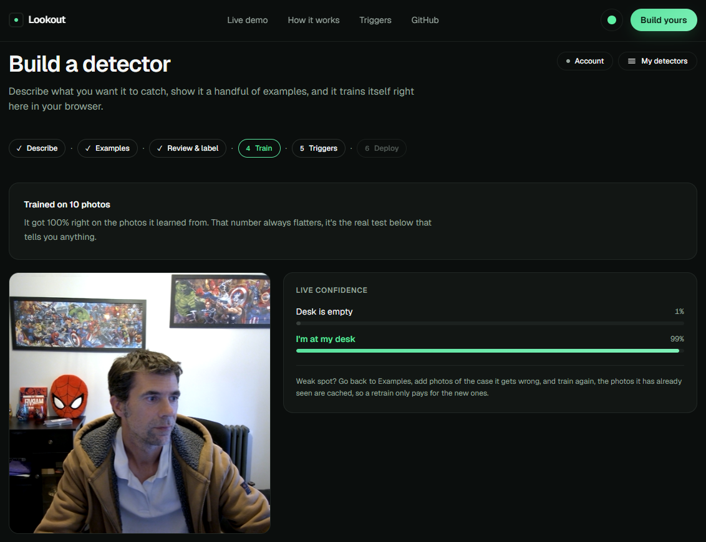
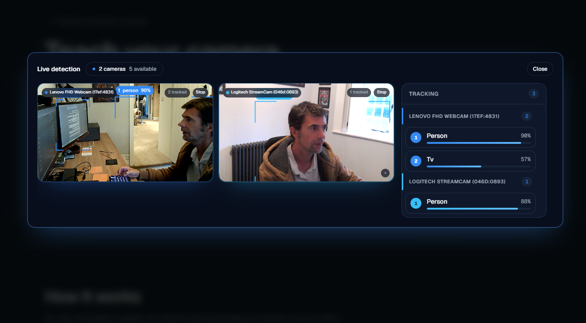

# Lookout

Lookout lets you build a custom camera detector in the browser. You describe what it should notice, give it some example photos, and train a small model in the page. When the detector sees what it was trained for, it can speak, show a notification, or send a message to Slack, Discord, a webhook or an email address. You don't need to write code or prepare a dataset.

**Live:** [lookout.vision](https://lookout.vision)



## What it does

1. **Describe** what you want it to notice, and name the groups it should tell apart, for example "holding a pen" and "not holding a pen".
2. **Show it examples.** Hold a button for a burst of webcam shots, or drop in photos. Five per group is enough to start but more will be better.
3. **Review and label (optional).** Claude checks your photos and flags any that look like they're in the wrong group, so you only need to look at those.
4. **Train.** Training takes a few seconds. You can then point the camera at the subject and watch the confidence for each group update live. The *Show what it's looking at* switch highlights the part of the picture that influenced the result.
5. **Triggers.** Choose which group to watch for, how long it needs to be seen, and what should happen: speech, a banner, a browser notification, Slack, Discord, a webhook or email. Up to three cameras can be used, with a choice of whether any camera or every camera has to see it.
6. **Share.** Create a link that runs the detector on another phone or laptop, and the person opening it doesn't need an account. The link contains the trained model and its on-device reactions. Your photos and your Slack, Discord, webhook and email settings aren't included.

Detectors are saved in the browser as you work. An optional account lets you back them up and restore them on another machine.



The homepage also has a live demo that recognises around 80 everyday objects and draws boxes around them, across one or more cameras, without any training.

## How it works

- **Training runs in the browser.** A frozen [MobileNet v2](https://github.com/tensorflow/tfjs-models/tree/master/mobilenet) turns each photo into a 1280-number feature vector, and a small two-layer classifier is trained on those vectors with [TensorFlow.js](https://www.tensorflow.org/js). This is transfer learning, the same approach used by Google's Teachable Machine. It runs on the local GPU, and the photos aren't uploaded anywhere for training.
- **"What it's looking at"** is a class activation map. MobileNet's feature vector is the average of a 7×7 grid of regional features, so Lookout reads that grid, averages it for the normal prediction, and also runs the classifier on each region to see which ones match the group. This adds very little work per frame. If the model internals it depends on aren't available, the switch is hidden.
- **Triggers are smoothed.** Scores are averaged over roughly a second, a condition has to hold for a set time before it fires, and a cooldown prevents repeats. With several cameras, each one votes yes, no, or abstains when it's unsure (for example when it can only see half of a person). This means a rule like "I've left my desk" won't fire while another camera can still see you.
- **The live demo** uses Google's [MediaPipe](https://ai.google.dev/edge/mediapipe/solutions/vision/object_detector) object detector (EfficientDet-Lite0) on the GPU, and falls back to the CPU if the GPU can't be used. It replaced TensorFlow.js COCO-SSD, which was less accurate on small and distant objects and needed about 85MB of downloads for its best model, compared with about 10MB for MediaPipe. The WebAssembly runtime is copied from the installed package at build time and served by the site.
- **Labelling help** sends only the photos you ask it to check to Claude (Haiku 4.5), using structured output so each answer maps back to a specific photo.
- **Actions that leave the browser** (Slack, Discord, webhooks, email) go through a server route, so webhook URLs and API keys aren't exposed to the page. Webhooks must use https, and addresses that resolve to private or reserved networks are rejected.
- **Run links** store the trained classifier at 8 bits per weight, which is about 170KB and within 1% of the original confidence scores. A single database function returns one share by its random link. Shares can't be listed, and only the owner can update or remove one.
- **Accounts** use [Supabase](https://supabase.com), with row-level security on every table and a private storage bucket. Backup and restore are manual actions rather than background sync, so nothing is overwritten without you choosing to.

## Optional features and keys

Each integration is enabled by an environment variable. If one isn't set, that feature is disabled in the UI with a note explaining why, and the rest of the app works as normal. See [`.env.example`](.env.example) for the full list.

| Variable | Enables |
| --- | --- |
| `ANTHROPIC_API_KEY` | AI-assisted labelling |
| `BREVO_API_KEY` or `RESEND_API_KEY`, plus `EMAIL_FROM` | Email triggers |
| `NEXT_PUBLIC_SUPABASE_URL`, `NEXT_PUBLIC_SUPABASE_ANON_KEY` | Accounts, backup and run links |

## Running it locally

```bash
npm install
git config core.hooksPath .githooks
cp .env.example .env.local
npm run dev
```

Then open [http://localhost:3000](http://localhost:3000). Without any keys, everything works except labelling, email, accounts and run links.

If you use accounts, apply the migrations in [`supabase/migrations`](supabase/migrations) to your own Supabase project.

## Stack

- [Next.js](https://nextjs.org) (App Router, TypeScript, Tailwind) on [Vercel](https://vercel.com)
- [TensorFlow.js](https://www.tensorflow.org/js) with MobileNet for training, and [MediaPipe Tasks](https://ai.google.dev/edge/mediapipe) for the live demo
- [Claude](https://www.anthropic.com/claude) via the Anthropic SDK for labelling
- [Supabase](https://supabase.com) for auth, Postgres and storage
- IndexedDB for on-device persistence
- Built with [Claude Code](https://www.anthropic.com/claude-code)
